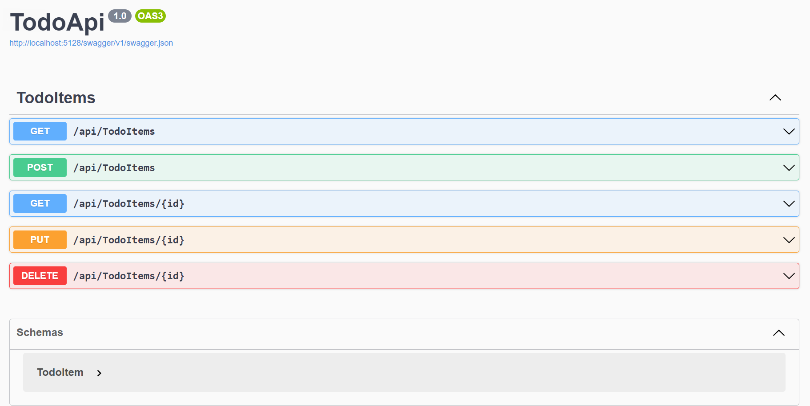

# ASP.NET Core Controller-Based API: ToDoApp

The **ToDoApp API** is a simple and efficient **ASP.NET Core Controller-Based API** designed for managing tasks in a to-do list. It enables users to create, read, update, and delete tasks (CRUD) through HTTP requests, providing seamless task management through API endpoints.

## Key Features
- **Create Task**: Add new tasks with descriptions and priority levels.
- **Retrieve Task**: Fetch a specific task by its unique `ID` or retrieve all tasks.
- **Update Task**: Modify task details, including the title, description, or status.
- **Delete Task**: Remove a task from the list by its unique `ID`.
- **Task Completion Status**: Track whether tasks are completed or still pending.

## Technologies Used
- **ASP.NET Core**: Utilized for building the Web API structure.
- **Entity Framework Core**: Used for managing task data through a relational database or in-memory database.
- **Swagger UI**: Integrated for API documentation and testing, providing a user-friendly interface to explore and interact with the API endpoints.

## Concepts Learned
Working on the **ToDoApp API** helped solidify my understanding of **ASP.NET Core** and **API development**, specifically:
- **Controller-Based APIs**: Creating APIs with ASP.NET Core using controllers to handle HTTP requests.
- **Routing**: Configuring endpoints to handle specific URLs, mapping them to controller actions.
- **Dependency Injection**: Leveraging ASP.NET Core's built-in dependency injection for services like the `DbContext`.
- **CRUD Operations**: Implementing Create, Read, Update, and Delete functionality through HTTP methods (`POST`, `GET`, `PUT`, `DELETE`).
- **Entity Framework Core**: Integrating Entity Framework for handling task data, using a database for data persistence.
- **Swagger UI**: Setting up Swagger to generate API documentation and provide an interactive UI for testing the API's functionality.

## What's Next
- ASP.NET Core MVC using SQL/MongoDB 
- Using a controller-based API in a web app.

## Dependencies
- **Microsoft.EntityFrameworkCore**: Entity Framework Core for data access.
- **Microsoft.EntityFrameworkCore.InMemory**: In-memory database for testing and development.

## Program Illustration
### Swagger UI
Below is an example of the **Swagger UI** used for exploring and testing the API:

